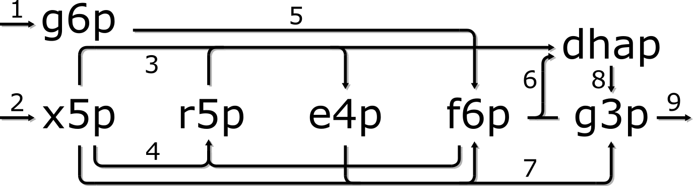

# GSModutils demo
## Shikimate production in *E. coli*
Demonstration of metabolic model management with [gsmodutils](https://academic.oup.com/bioinformatics/article/35/18/3397/5317162).

Based on shikimate production in *E. coli* as described by [Fujiwara et al. 2020](https://www.nature.com/articles/s41467-019-14024-1).

Start by opening a python console and importing GSMProject and cobrapy,

```python
from gsmodutils import GSMProject
import cobra
```

then load the current project,

```python
project = GSMProject('.')  # load project from current directory
```

and load the *E. coli* [genome scale model](https://www.embopress.org/doi/full/10.1038/msb.2011.65).

```python
m = project.models[1]  # load E. coli GSM iJO1366 
```

The next step is to check that the model supports growth on glucose and save the corresponding constraints as a 
'conditions' .json file,

```python
sol = m.optimize()  # maximise growth on glucose
print('growth rate (glc):',sol.objective_value)  # print result
project.save_conditions(m, 'glc_growth')  # create conditions file 
```

then repeat this step, first for growth on xylose + glucose, then for growth on xylose only.

```python
m.exchanges.get_by_id('EX_xyl__D_e').bounds = (-10,1000)  # allow xylose uptake
sol = m.optimize()
print('growth rate (glc+xyl):',sol.objective_value)
project.save_conditions(m, 'glc_and_xyl_growth')

m.exchanges.get_by_id('EX_glc__D_e').bounds = (0,1000)  # prevent glucose uptake
sol = m.optimize()
print('growth rate (xyl):',sol.objective_value)
project.save_conditions(m, 'xyl_growth')
```

At this stage, the gsmodutils test utility can be executed from the command line

```shell script
$ gsmodutils test
```

which shows that the model supports growth on the expected substrates with the following output

```shell script
    --model::iJO1366.json::conditions::glc_growth

    --model::iJO1366.json::conditions::glc_and_xyl_growth

    --model::iJO1366.json::conditions::xyl_growth
```

These basic tests can be run at any time to monitor model behaviour after modification.

One aim stated in Fujiwara *et al.* is to create a "xylose catabolic pathway that directly flows into the 
TCA cycle without interfering glycolysis and PPP."
The diagram below is a general (and simplified) scheme of the pentose phosphate pathway, 



where 1 = glucose phosphorylation to glucose-6p; 2 = xylulose phosphorylation to xylulose-5p; 3 = transketolase 1, 
phosphofructokinase, fructose-bisphosphate aldolase, topoisomerase; 4 = ribose-phosphate epimerase, ribulose-phosphate 
epimerase, ...; 5 = isomerase; 6 = fructose-6p phosphorylation and cleavage; 7 = transketolase 2; 8 = ...; 
and 9 = further glycolysis.

 